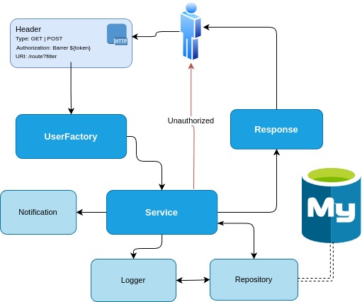
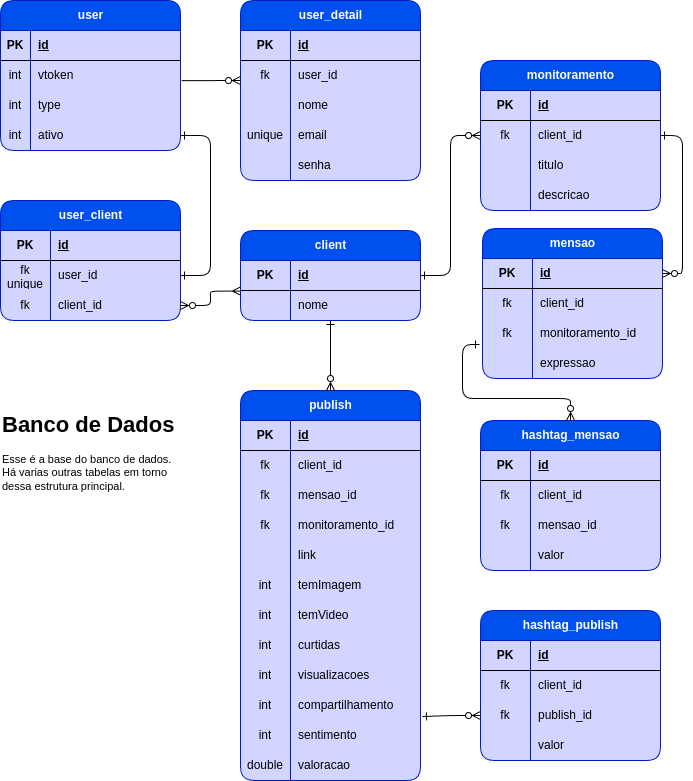

# API DATANEXA
API dos serviços

# Arquitetura da API

# Banco de Dados

## Requisições

- Filtros são realizados via GET

### Publicações

- Todas as publicações estão vinculadas a uma mensão, um monitoramento e um cliente.
